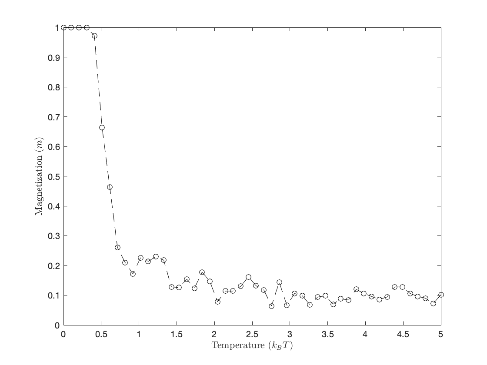

## Introduction

Phase transitions, which refers to thermodynamic properties undergo sudden changes or tend towards infinity around specific temperatures, are common occurrences in nature. Despite the smooth and bounded nature of natural Hamiltonians, how can we relate them to these abrupt changes in thermodynamic quantities? Furthermore, can one partition function expression encompass the phase transitions of various phases simultaneously? One solution lies in constructing simplified models that capture the essential features of a system and rigorously deriving their macroscopic properties at phase transition points. Among these models, the Ising model stands out.

The Ising model was developed specifically to explore and understand the phenomenon known as ferromagnetism, which involves the phase transition behavior observed in ferromagnetic materials. This encompasses scenarios such as the loss of magnetism as a magnet is heated beyond a critical temperature and its reappearance upon cooling below said critical temperature. The magnetic properties of ferromagnetic materials primarily stem from the spin-orbit magnetic moment of electrons within magnetic atoms. Due to a robust exchange coupling between adjacent electrons, in the absence of an external magnetic field, their spin magnetic moments spontaneously align within small regions, forming magnetized domains. In unmagnetized ferromagnetic materials, these domains exhibit different magnetization directions, resulting in no macroscopic magnetism. Upon the application of an external magnetic field, domains with magnetization directions akin to the field expand, incorporating neighboring domains with opposing magnetization directions. Consequently, the magnetization of each domain gradually aligns with the external magnetic field, rendering the material "magnetized". However, with increasing temperature, the overall magnetism diminishes, and at the critical temperature, the system undergoes a phase transition wherein all magnetization disappears. Thus, our objective is to elucidate the thermal behavior of ferromagnets.

## The Ising model

### The basic Hamiltonian

In the Ising model, we consider a lattice composed of $N$ sites arranged in a $d$-dimensional space. Each lattice site hosts a quantum spin, capable of being in one of two states: spin up ($\uparrow$) or spin down ($\downarrow$), denoted by the eigenvalues $s_i=\pm 1$ for the spin on the $i^\text{th}$ site. The Hamiltonian of the Ising model is represented as:

$$
H\{\alpha*k\}=-J\sum*{\langle i,j\rangle}s_is_j-B\sum_is_i,
$$

where $\{\alpha_k\}=\{s_1,s_2,\dots,s_N\}$ describes the spin orientations. Here, the notation $\langle i,j\rangle$ signifies a sum over pairs of adjacent lattice sites, representing nearest neighbors interactions. The parameter $J$ denotes the strength of the interaction between spins, and $B$ represents an external magnetic field.

In the case where $J > 0$, neighboring spins tend to align with each other ($\uparrow\uparrow$ or $\downarrow\downarrow$), leading to a state of **ferromagnetism**. Conversely, if $J < 0$, spins prefer to anti-align ($\uparrow\downarrow$), resulting in an **anti-ferromagnetic** state. For our discussion, we'll focus on the scenario where $J>0$.

When examining phase transitions in ferromagnetic systems, our central concern is often the system's average spin, denoted as:

$$
m=\frac{1}{N}\sum_{i} s_i,
$$

commonly referred to as the average magnetization. The partition function of the system is given by:

$$
Z=\sum_{{\alpha_k}}\mathrm{e}^{-\beta H\{\alpha_k\}},
$$

where the sum is taken over all possible spin configurations $\{\alpha_k\}$. From this partition function, we can derive all thermodynamic properties of the system.

The Ising model originated from the work of Wilhelm Lenz, who initially developed the idea, passing it on to his student Ernst Ising. In his seminal paper, Ising investigated the one-dimensional model, concluding that it does not exhibit any phase transition. However, the two-dimensional model posed a more intricate challenge, eventually solved analytically by Lars Onsager. On the other hand, the three-dimensional Ising model still eludes an analytical solution, remaining a subject of computational exploration.

### Theoretical solutions of the one-dimensional Ising model

In the one-dimensional Ising model, periodic boundary conditions $s_1=s_{N+1}$ are applied. The partition function can be written as:

$$
\begin{aligned} Z
&=\sum_{s_1=\pm1}\sum_{s_2=\pm1}\cdots\sum_{s_N=\pm1}e^{-\beta H}\\
&=\sum_{s_1=\pm1}\sum_{s_2=\pm1}\cdots\sum_{s_N=\pm1}e^{\beta J\sum_{\langle i,j\rangle}s_is_j-\beta B\sum_{i}s_i}\\
&=\sum_{s_1=\pm1}\sum_{S_2=\pm1}\cdots\sum_{s_N=\pm1}A_{s_1s_2}A_{s_2s_3}\cdots A_{s_Ns_1}, \end{aligned}
$$

where $A_{s_is_j}$ represents the elements of the matrix $\underline{\underline{A}}\$:

$$
\underline{\underline{A}}=\begin{pmatrix} e^{\beta J+\beta B} & e^{-\beta J+\beta B}\\ e^{-\beta J-\beta B} & e^{\beta J-\beta B} \end{pmatrix}.
$$

Using linear algebra, the partition function can be simplified to

$$
Z=\lambda_+^N+\lambda_-^N,
$$

where $\lambda_\pm$ are the eigenvalues of the matrix $\underline{\underline{A}}$, given by

$$
\lambda*\pm=e^{\beta J}\cosh(\beta B)\pm\sqrt{e^{2\beta J}\cosh^2(\beta B)-2\sinh(2\beta J)}.
$$

Therefore, when the system size $N$ is sufficiently large, we can approximate the partition function as

$$
Z=\lambda_+^N\left[1+\left(\frac{\lambda_-}{\lambda_+}\right)^N\right]\approx \lambda_+^N.
$$

Consequently, the Helmholtz free energy per lattice site is

$$
f(B,T)=-\frac{1}{N}k_BT\ln Z=-k_BT\ln \lambda_+,
$$

and the magnetization is then given by

$$
m(B,T)=-\left(\frac{\partial f}{\partial B}\right)\_T=\frac{\sinh(\beta B)}{\sqrt{\cosh^2(\beta B)-2\mathrm{e}^{2\beta J}\sinh(2\beta J)}}.
$$

Indeed, it's worth noting that the magnetization $m(B, T)$ is an analytical function for real values of the magnetic field $B$ and positive temperatures $T$. This implies that there are no phase transitions for positive temperatures in the one-dimensional Ising model.

## Simulation of the Ising model

In this section, we will discuss the simulation of the Ising model, a fundamental model in statistical mechanics, particularly in the study of phase transitions in magnetic systems. We will focus on using the Metropolis algorithm, a widely employed Monte Carlo method, to simulate the behavior of the Ising model at thermal equilibrium.

### Metropolis algorithm

The Metropolis algorithm is a powerful tool for simulating systems in thermal equilibrium. It generates a sequence of configurations (a Markov chain) that accurately represents the fluctuations observed during thermal equilibrium. The algorithm randomly modifies individual spins according to specific criteria to ensure that the probability of a configuration follows the Boltzmann distribution.

The Metropolis algorithm proceeds as follows:

1. **Initialization:** Begin with an arbitrary spin configuration.
2. **Trial Configuration:** Generate a trial configuration by randomly selecting a spin to flip.
3. **Energy Computation:** Calculate the energy of the trial configuration.
4. **Energy Comparison:** Compare the energy change ($\Delta E$) resulting from the trial configuration to the current configuration. If $\Delta E \leq 0$, accept the flip unconditionally. Otherwise, proceed to the next step.
5. **Acceptance Criterion:** If $\Delta E > 0$, accept the flip with a probability of $\exp(-\Delta E/k_BT)$, where $k_B$ is the Boltzmann constant and $T$ is the temperature. This step allows the system to occasionally explore configurations with higher energy, mimicking thermal fluctuations.
6. **Iteration:** Repeat steps 2-5 for a large number of iterations until the system reaches thermal equilibrium.

By iterating through these steps, the Metropolis algorithm generates a sequence of configurations that accurately represents the equilibrium behavior of the Ising model at a given temperature. Next, we will discuss the implementation of the Metropolis algorithm for simulating the Ising model and analyzing its properties.

### One-dimensional Ising model

To simulate the one-dimensional Ising model using the Metropolis algorithm, we follow the general procedure outlined earlier. We initialize the system with a specific configuration of spins and iteratively apply the Metropolis algorithm to generate a sequence of configurations representing the equilibrium state of the system at a given temperature.




```matlab
clear;  % Clear workspace

% Parameters
N = 100;          % Number of lattice points
J = 1;            % Exchange coupling constant
T_list = linspace(0.001, 5, 50);    % Temperature (kT)

mean_magnetization = zeros(1, length(T_list));  % Initialize the magnetization
mean_energy = zeros(1, length(T_list));         % Initialize the energy

magnetization = zeros(10, length(T_list)); % Preallocate array to store magnetization results
energy = zeros(10, length(T_list));        % Preallocate array to store energy results

% Loop over each temperature in the temperature list
for idx = 1:length(T_list)
    T = T_list(idx);

    % Perform multiple simulations for statistical averaging
    for i = 1:10
        [spins, energy(i, idx)] = solveIsing(N, T, J);  % Call the function to simulate Ising model
        magnetization(i, idx) = abs(mean(spins(:)));
    end

    % Calculate the mean of the results
    mean_magnetization(idx) = mean(magnetization(:, idx));
    mean_energy(idx) = mean(energy(:, idx));
end

% Plot the mean energy versus temperature
figure(420);
plot(T_list, mean_energy, 'ko--');
xlabel('Temperature $(k_BT)$', 'Interpreter', 'latex');
ylabel('Energy $(E)$', 'Interpreter', 'latex');
savefig('1d_energy_plot.fig');

% Plot the mean magnetization versus temperature
figure(421); % Create a new figure for the magnetization plot
plot(T_list, mean_magnetization, 'ko--');
xlabel('Temperature $(k_BT)$', 'Interpreter', 'latex');
ylabel('Magnetization $(m)$', 'Interpreter', 'latex');
savefig('1d_magnetization_plot.fig');

% Function to simulate the Ising model using the Metropolis algorithm
function [spins, energy] = solveIsing(N, T, J)
    % Initialize a spin configuration
    spins = ones(1, N);

    % Number of simulation steps
    num_steps = 200*N;

    % Metropolis algorithm simulation
    for step = 1:num_steps
        % Randomly choose a lattice point
        i = randi([1, N]);

        % Calculate energy change
        delta_E = 2 * J * spins(i) * ( ...
            spins(mod(i - 2, N) + 1) + spins(mod(i, N) + 1));

        % Metropolis acceptance criterion
        if rand() < exp(-delta_E / T)
            spins(i) = -spins(i);
        end
    end

    energy = 0; % Initialize the energy
    for i=1:N-1
        energy = energy - J * spins(i) * spins(i+1);
    end
end
```

### Two-dimensional Ising model

Moving beyond the simplicity of the one-dimensional Ising model, we delve into the richer behavior of the two-dimensional Ising model. This model captures more realistic features of magnetic materials by considering spins arranged on a two-dimensional lattice, such as a square lattice. The interactions between neighboring spins in this model can lead to fascinating phenomena, including phase transitions and critical behavior.

To simulate the two-dimensional Ising model, we extend the Metropolis algorithm to handle the additional complexity introduced by the lattice structure. Similar to the one-dimensional case, we initialize the system with a specific configuration of spins and iteratively apply the Metropolis algorithm to update the spin configuration. However, in the two-dimensional case, we must consider interactions between spins in both horizontal and vertical directions.


At low temperatures in the two-dimensional Ising model, the spins tend to align parallel to each other, resulting in a non-zero magnetization. This alignment arises due to the dominance of spin-spin interactions over thermal fluctuations, leading to the formation of ferromagnetic domains.

As the temperature increases, thermal fluctuations become more prominent, disrupting the alignment of spins and reducing the overall magnetization of the system. At a critical temperature known as the Curie temperature ($T_C$), the system undergoes a phase transition from a ferromagnetic phase to a paramagnetic phase, where the magnetization vanishes.

```matlab
clear;  % Clear workspace

% Parameters
N = 50;          % Number of lattice points (N*N)
J = 1;           % Exchange coupling constant
T_list = linspace(0.001, 5, 16);    % Temperature

mean_magnetization = zeros(1, length(T_list));  % Initialize the magnetization
mean_energy = zeros(1, length(T_list));         % Initialize the energy

magnetization = zeros(10, length(T_list)); % Preallocate array to store magnetization results
energy = zeros(10, length(T_list));        % Preallocate array to store energy results

figure(820); % Create a new figure outside the loop
custom_colormap = [177 217 229; 52 73 100]/255;

% Loop over each temperature in the temperature list
for idx = 1:length(T_list)
    T = T_list(idx);

    % Perform multiple simulations for statistical averaging
    for i = 1:10
        [spins, energy(i, idx)] = solveIsing(N, T, J);  % Call the function
        magnetization(i, idx) = abs(mean(spins(:))); % Compute mean magnetization directly
    end

    % Calculate the mean of the results
    mean_magnetization(idx) = mean(magnetization(:, idx));
    mean_energy(idx) = mean(energy(:, idx));

    % Plot the spins directly
    subplot(4, 4, idx); % 4 rows, 4 columns
    imagesc(spins);
    colormap(custom_colormap);
    axis equal
    title(['$k_BT=$', num2str(round(T,2)), ...
        ', $|m|=$', num2str(round(mean_magnetization(idx),2))], ...
        'Interpreter', 'latex');
    set(gca,'XTick',[], 'YTick', []);
    axis tight
end

savefig('2d_spins.fig');

% Plot mean magnetization
figure(821); % Create a new figure for the magnetization plot
plot(T_list, mean_magnetization, 'ko--');
xlabel('Temperature $(k_BT)$', 'Interpreter', 'latex');
ylabel('Magnetization $(m)$', 'Interpreter', 'latex');
savefig('2d_magnetization_plot.fig');

% Plot mean energy
figure(822); % Create a new figure for the energy plot
plot(T_list, mean_energy, 'ko--');
xlabel('Temperature $(k_BT)$', 'Interpreter', 'latex');
ylabel('Energy $(E)$', 'Interpreter', 'latex');
savefig('2d_energy_plot.fig');

function [spins, energy] = solveIsing(N, T, J)
    % Initialize a spin configuration
    spins = ones(N);

    % Number of simulation steps
    num_steps = 200*N^2;

    % Metropolis algorithm simulation
    for step = 1:num_steps
        % Randomly choose a lattice point
        i = randi([1, N]);
        j = randi([1, N]);

        % Calculate energy change
        delta_E = 2 * J * spins(i, j) * ( ...
            spins(mod(i - 2, N) + 1, j) + spins(mod(i, N) + 1, j) + ...
            spins(i, mod(j - 2, N) + 1) + spins(i, mod(j, N) + 1));

        % Metropolis acceptance criterion
        if rand() < exp(-delta_E / T)
            spins(i, j) = -spins(i, j);
        end
    end

    energy = 0; % Initialize the energy
    for i=1:N-1
        for j=1:N-1
            energy = energy - J * spins(i,j) * ( ...
                spins(i,j+1) + spins(i+1,j));
        end
    end
end
```
