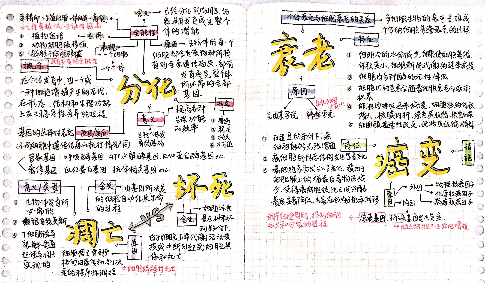
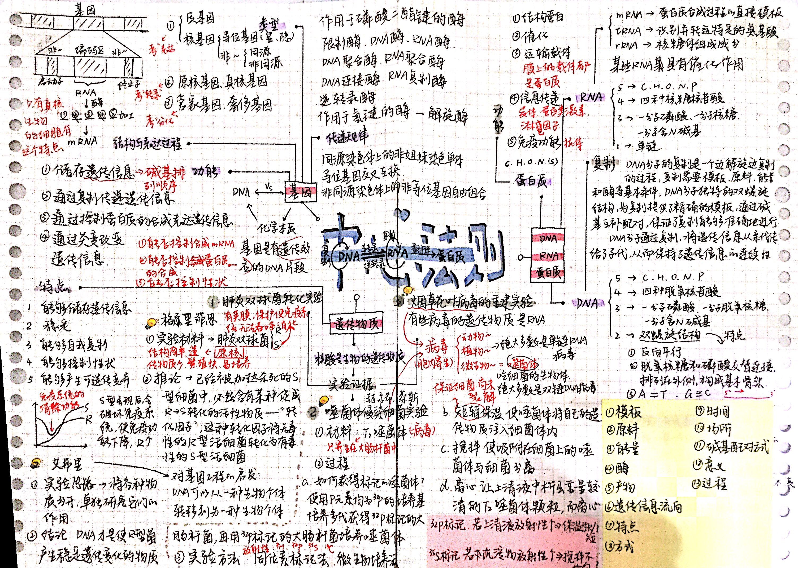
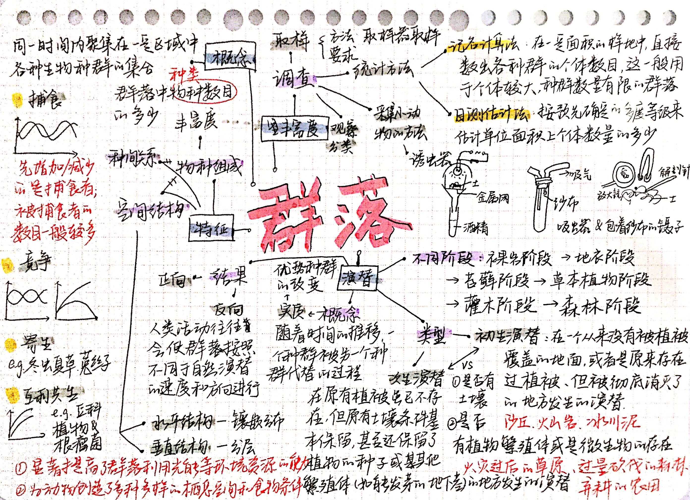
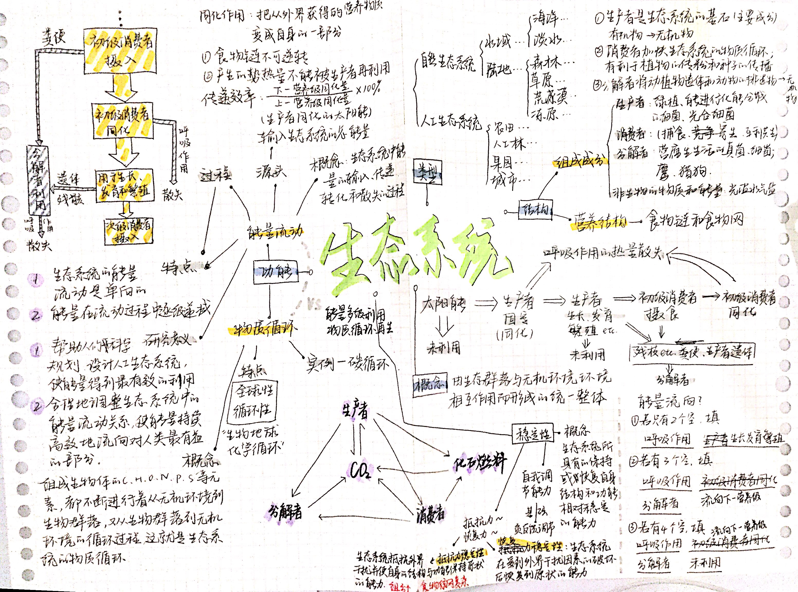

（以下中文内容由Cursor自动翻译，还没仔细检查翻译内容，我会缓慢手动更新的！）

这里是我的高中生物笔记，专门为高效和有针对性的**高考**准备而创建。

本指南将最关键的概念、图表和解题策略整合到一个文档中，旨在帮助你在考试前有效地复习核心材料。

[**下载精华要点 (PDF)**](/notes/high-school-biology/pdf/biology-golden-nuggets.pdf) 包含快速复习的基本事实和总结。

这个合集包含我为高中生物课程创建的一系列思维导图，旨在使复杂主题更容易可视化和记忆。

以下是思维导图的预览，涵盖细胞生物学、遗传学、进化和生态学的关键领域。

#### 思维导图画廊

