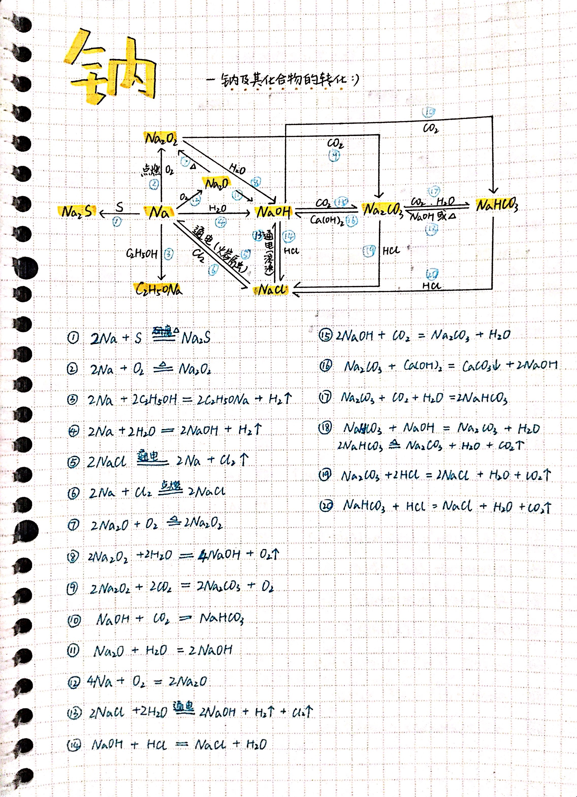
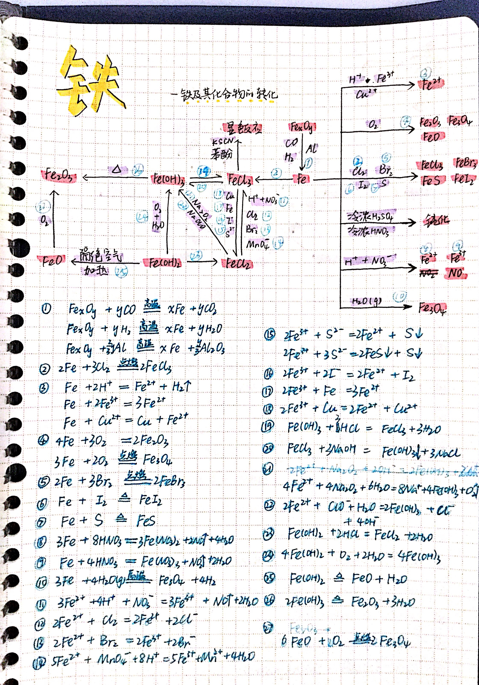

（以下中文内容由Cursor自动翻译，还没仔细检查翻译内容，我会缓慢手动更新的！）

这里是我的高中化学笔记，分为两个部分以支持深入学习和高效的高考准备。特别感谢我的同学**李坤鹏**，他提供了自己的课堂笔记供我参考。

- [**综合课程笔记 (PDF)**](/notes/high-school-chemistry/pdf/chemistry.pdf): 涵盖整个课程的详细笔记。
- [**期末复习指南 (PDF)**](/notes/high-school-chemistry/pdf/chemistry-review.pdf): 关键概念的浓缩总结，便于快速复习。
- [**物质结构推理**](/notes/high-school-chemistry/pdf/reasoning.pdf): 解决物质结构推理题的指南。

#### 关键化学方程式总结

以下是常见元素关键化学方程式的可视化总结。

